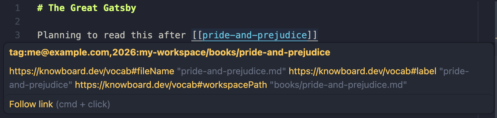

To demonstrate some of the features of Knowboard, we'll walk through setting up a workspace with a couple documents describing a couple of books.

This tutorial will show how to:

- add properties describing the books
- link and navigate between documents
- augment your documents with separate "data files"
- use [queries](../querying) to explore the data
- add [shapes](../shapes) to describe the structures

# Configuring a workspace

Start by creating a `.knowboard.toml` at the base directory where your documents will be stored.

```toml title=".knowboard.toml"
base_uri = "tag:me@example.com,2026:my-workspace/"
```

The `base_uri` here should use your email address, a date (usually just the current year is sufficient) and a name. This will serve as a unique prefix for the documents in this workspace, which we'll look at more later when using this to identify contents in the workspace.

For alternative formats, [read more about picking a `base_uri`](/guides/base/).

# Adding documents

Most of your content will be stored in Markdown files. Let's start with an entry to describe a book:

```md title="books/pride-and-prejudice.md"
# Pride and Prejudice

Use the body of the document to add notes, or other content.
```

Let's add one more book to work with:

```md title="books/great-gatsby.md"
# The Great Gatsby

Planning to read this after [[pride-and-prejudice]]
```

If Knowboard is running, you should see a preview like this when you hover over
the Wiki Link in the document:



Using your editor's shortcut (e.g. `Cmd Click` or `Ctrl Click`) should navigate
to the other document.

Next we'll start adding more structured properties to the documents.
