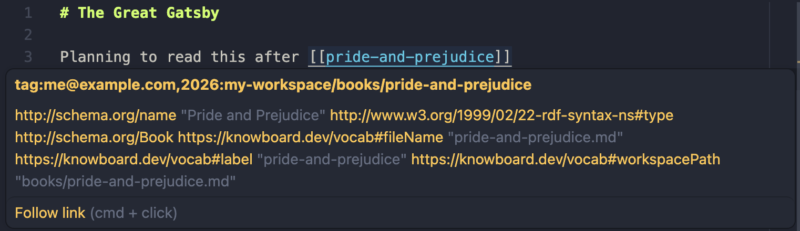

While the `[[wiki-links]]` shown before are a convenient way to link between
documents, the real power in Knowboard comes from adding structured properties
to describe your documents.

Since we're documenting books, we're going to start with https://schema.org/Book
as the basis for our document. Take a quick look at the Book entry to get a
sense of the information schema.org provides. It may seem a bit overwhelming,
but we only need to add little bits of information as they're needed.

For our purposes, we just care about recording the [name](https://schema.org/name)
of the book right now.

Add the structured properties to the beginning of the document with `---`
to mark the top and bottom of that section:

```md title="books/pride-and-prejudice.md"
---
# Your properties should start with a `@context` describing
# where the terms used are defined:
"@context":
  "@vocab": http://schema.org/

# Now specify that this document describes a Book:
"@type": Book

# And we'll move the title of the book into the "name" property:
name: Pride and Prejudice
---

Use the body of the document to add notes, or other content.
```

:::note[Check out the link preview again]

Notice how the terms were expanded to `http://schema.org/Book` and
`http://schema.org/name` based on the `@vocab`:



_Don't worry, we'll learn how to make that preview [look much nicer](../shapes)_
:::

The properties are specified in a format called [YAML-LD](https://w3c.github.io/yaml-ld/).

The tutorial will slowly introduce concepts as about YAML-LD and the broader
"Resource Description Framework" it is a part of. For additional details refer
to the [RDF Primer](/reference/rdf-primer/).

Update the other book entry to include structured properties as well:

```md title="books/great-gatsby.md"
---
"@context":
  "@vocab": http://schema.org/
"@type": Book
name: The Great Gatsby
---
```
