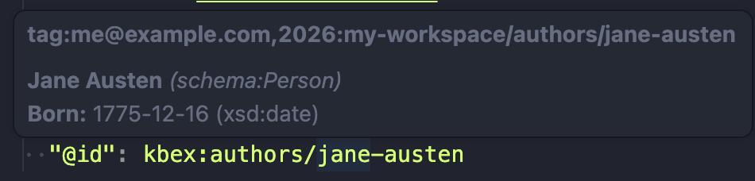

import { Tabs, TabItem } from '@astrojs/starlight/components';

As your workspace grows it can help to describe what fields and relationships
exist for different types of data.

Knowboard recognizes the [Shapes Constraint Language](https://www.w3.org/TR/shacl/)
(SHACL) to describe your data. Public entities like schema.org may provide their
own shapes, but we'll build up a simple representation of the shapes to
describe just the fields that we use for this example.

So far we've used YAML-LD for consistency, but since most of the documentation
for SHACL uses the Turtle format, we'll switch to that for this section.

{/* <!-- TODO: might be worth porting to keep it consistent? --> */}

We can describe the "shape" of a Book, and list properties like the "name" that exist for that class:

<Tabs syncKey="rdf-format">
  <TabItem label="YAML-LD">
    ```turtle title="shapes.yamlld"
    "@context":
      kbex: "tag:me@example.com,2026:my-workspace/"
      sh: "http://www.w3.org/ns/shacl#"
      schema: "http://schema.org/"

    "@graph":
      - "@id": kbex:BookShape
        "@type": sh:NodeShape
        sh:targetClass: {"@id": schema:Book}
        sh:property:
          - sh:path: {"@id": schema:name}
    ```
  </TabItem>
  <TabItem label="Turtle">
    ```turtle title="shapes.ttl"
    @prefix kbex: <tag:me@example.com,2026:my-workspace/> .
    @prefix sh: <http://www.w3.org/ns/shacl#> .
    @prefix schema: <http://schema.org/> .

    kbex:BookShape a sh:NodeShape ;
        sh:targetClass schema:Book ;
        sh:property [
            sh:path schema:name ;
        ] .
    ```
  </TabItem>
</Tabs>

In one of your book documents, try adding a blank line, and
activate your editor's auto-complete. You should see "name"
pop up as a suggested field:

```md
---
"@context":
    "@vocab": "http://schema.org/"
    "kbex": "tag:me@example.com,2026:my-workspace/"
"@type": Book
<try to auto-complete on this line>
---
```

## Adding relationships

Next we can add a similar description for the author's shape as a "Person" with
a "name". In the "Book" shape, we can note that the "author" property should
refer to a "Person".

<Tabs syncKey="rdf-format">
  <TabItem label="YAML-LD">
    ```turtle title="shapes.yamlld" ins={12-19}
    "@context":
      kbex: "tag:me@example.com,2026:my-workspace/"
      sh: "http://www.w3.org/ns/shacl#"
      schema: "http://schema.org/"

    "@graph":
      - "@id": kbex:BookShape
        "@type": sh:NodeShape
        sh:targetClass: {"@id": schema:Book}
        sh:property:
          - sh:path: {"@id": schema:name}
          - sh:path: {"@id": schema:author}
            sh:class: {"@id": schema:Person}

      - "@id": kbex:AuthorShape
        "@type": sh:NodeShape
        sh:targetClass: {"@id": schema:Person}
        sh:property:
          - sh:path: {"@id": schema:name}
    ```
  </TabItem>
  <TabItem label="Turtle">
    ```turtle title="shapes.ttl" ins={9-12,14-20}
    @prefix kbex: <tag:me@example.com,2026:my-workspace/> .
    @prefix sh: <http://www.w3.org/ns/shacl#> .
    @prefix schema: <http://schema.org/> .

    kbex:BookShape a sh:NodeShape ;
        sh:targetClass schema:Book ;
        sh:property [
            sh:path schema:name ;
        ] ;
        sh:property [
            sh:path schema:author ;
            sh:class schema:Person ;
        ] .

    kbex:AuthorShape a sh:NodeShape ;
        sh:targetClass schema:Person ;
        sh:property [
            sh:path schema:name ;
        ] .
    ```
  </TabItem>
</Tabs>

Now auto-complete inside a "Book" document should also show the "author" as a
suggested property name, and completions for the value should show the
people we described in `authors.yamlld`.

## Better previews

Knowboard can also use the shapes to give more informative previews of your
data. By adding "property roles" you can indicate which properties are most
important to display.

For this, we use [DASH](https://datashapes.org/propertyroles.html).

By designating one property in the shape as the "LabelRole", this will be
displayed as the title for that type. Additional properties can be designated
with "KeyInfoRole" to add them to the summary with a label.
<Tabs syncKey="rdf-format">
  <TabItem label="YAML-LD">
    ```turtle title="shapes.yamlld" ins={5,13,15,23-26}
    "@context":
      kbex: "tag:me@example.com,2026:my-workspace/"
      sh: "http://www.w3.org/ns/shacl#"
      schema: "http://schema.org/"
      dash: "http://datashapes.org/dash#"

    "@graph":
      - "@id": kbex:BookShape
        "@type": sh:NodeShape
        sh:targetClass: {"@id": schema:Book}
        sh:property:
          - sh:path: {"@id": schema:name}
            dash:propertyRole: {"@id": dash:LabelRole}
          - sh:path: {"@id": schema:author}
            dash:propertyRole: {"@id": dash:KeyInfoRole}
            sh:class: {"@id": schema:Person}

      - "@id": kbex:AuthorShape
        "@type": sh:NodeShape
        sh:targetClass: {"@id": schema:Person}
        sh:property:
          - sh:path: {"@id": schema:name}
            dash:propertyRole: {"@id": dash:LabelRole}
          - sh:path: {"@id": schema:birthDate}
            sh:name: "Born"
            dash:propertyRole: {"@id": dash:KeyInfoRole}
    ```
  </TabItem>
  <TabItem label="Turtle">
    ```turtle ins={4,10,14,22-27} title="shapes.ttl"
    @prefix kbex: <tag:me@example.com,2026:my-workspace/> .
    @prefix sh: <http://www.w3.org/ns/shacl#> .
    @prefix schema: <http://schema.org/> .
    @prefix dash: <http://datashapes.org/dash#> .

    kbex:BookShape a sh:NodeShape ;
        sh:targetClass schema:Book ;
        sh:property [
            sh:path schema:name ;
            dash:propertyRole dash:LabelRole ;
        ] ;
        sh:property [
            sh:path schema:author ;
            dash:propertyRole dash:KeyInfoRole ;
            sh:class schema:Person ;
        ] .

    kbex:AuthorShape a sh:NodeShape ;
        sh:targetClass schema:Person ;
        sh:property [
            sh:path schema:name ;
            dash:propertyRole dash:LabelRole ;
        ] ;
        sh:property [
            sh:path schema:birthDate ;
            sh:name "Born" ;
            dash:propertyRole dash:KeyInfoRole ;
        ] .
    ```
  </TabItem>
</Tabs>

```yaml ins={4,10-12,17-19} title="authors.yamlld"
"@context":
  "@base": "tag:me@example.com,2026:my-workspace/authors/"
  schema: "http://schema.org/"
  xsd: "http://www.w3.org/2001/XMLSchema#"

"@graph":
  - "@id": f-scott-fitzgerald
    "@type": schema:Person
    schema:name: F. Scott Fitzgerald
    schema:birthDate:
      "@value": 1896-09-24
      "@type": xsd:date

  - "@id": jane-austen
    "@type": schema:Person
    schema:name: Jane Austen
    schema:birthDate:
      "@value": 1775-12-16
      "@type": xsd:date
```

Now, hovering over an author should show a clearer description of that person:


